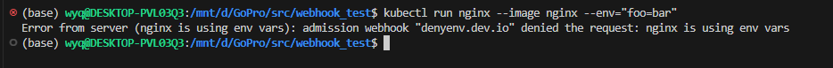

# 实验命令

## 生成证书
```bash
sh create-csr-cert.sh --service denyenv --namespace default  --secret denyenv-tls-secret
```

## 证书base64编码

```bash
cat ca.crt | base64 -w 0
```
## 编译webhook服务

```bash
GOOS=linux go build -o denyenv-validating-admission-webhook ./main.go
```
## 用服务端私钥和服务端证书生成K8S集群的secret资源，挂载到webhook工作负载中   

```bashs
kubectl create secret generic denyenv-tls-secret  --from-file=tls.key=certs/denyenv.key  --from-file=tls.crt=certs/denyenv.crt
```
##  测试（webhook服务正常）



# 教程
https://bbs.huaweicloud.com/blogs/419088#H11